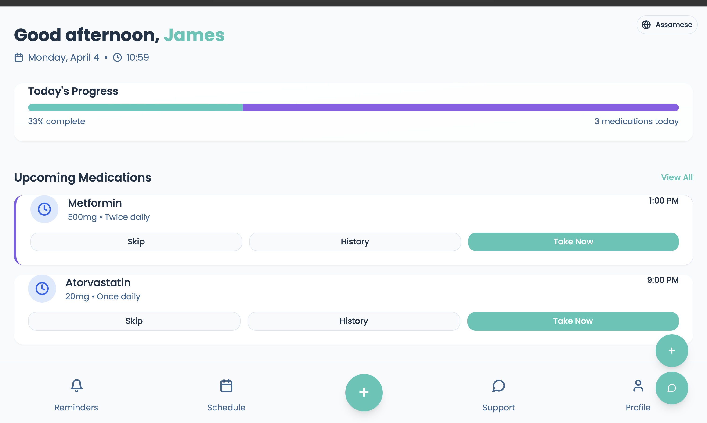
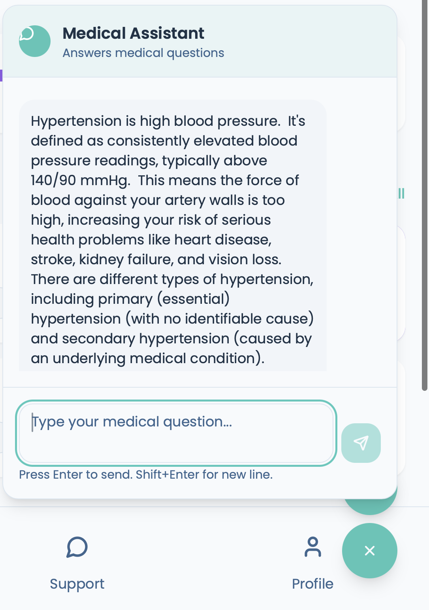
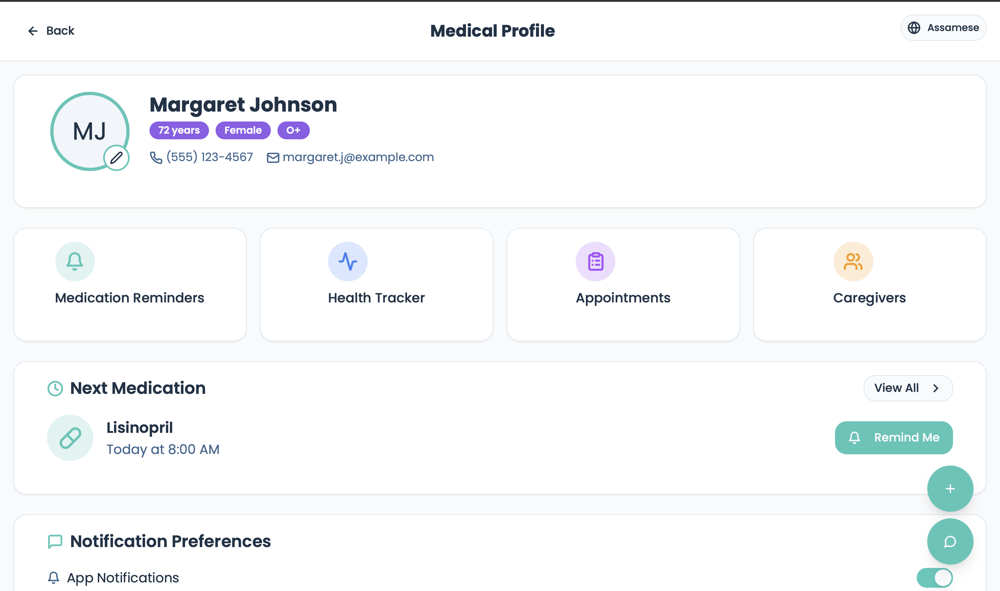
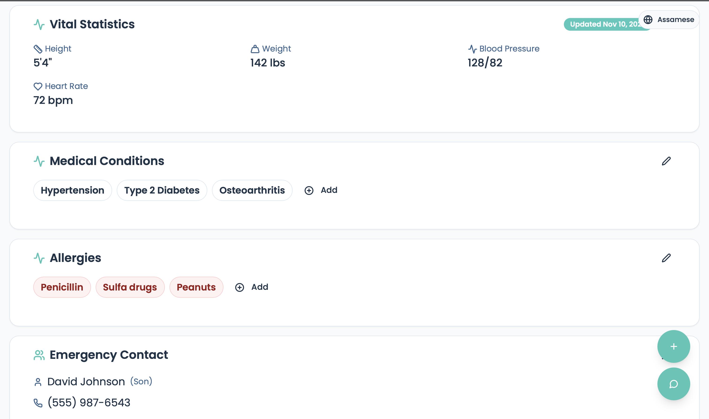
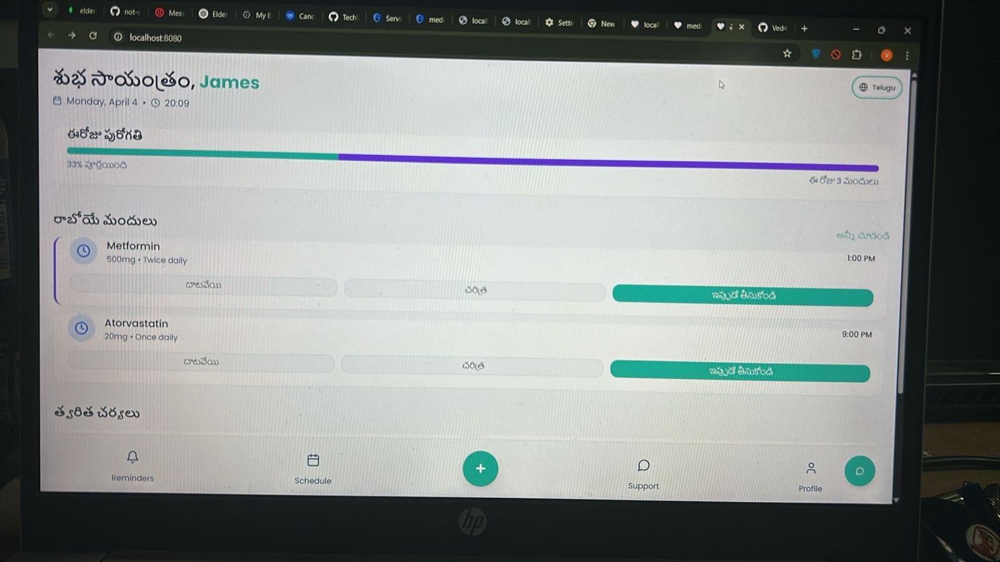

# ElderMed Integrated Application

This project integrates several components into a unified healthcare application:

- React Frontend with Medication Management
- Express Backend with MongoDB Integration
- Medical Chatbot with AI capabilities
- OCR Processing for Prescription Scanning
- Translation Services for Multiple Languages
- Browser Notifications for Medication Reminders


## 🙌 Contributors

This project was a collaborative effort. Huge thanks to:

- [@not-cmd](https://github.com/not-cmd)
- [@TechWizDhruv](https://github.com/TechWizDhruv)
- [@harrsh45](https://github.com/harrsh45)
- [@Ved4ntBhole](https://github.com/Ved4ntBhole)
See [CONTRIBUTORS.md](./CONTRIBUTORS.md) for details on each member's role.

## Project Screenshots

### Dashboard

*Main dashboard with medication reminders and quick access to services*

### Reminders

*Creating a new medication reminder*


*View of all created medication reminders*

### Medical Chatbot

*AI-powered Medical Chatbot interface*

### User Profile 

*User profile management screen*


*Additional profile settings*

### Translation Feature

*Dashboard with translated content*

### Additional Features

*Overview of other available features*

## Project Structure

```
eldermed/
├── features/              # Shared services (OCR, NLP, Translation)
├── eldermed-backend/      # Backend server with MongoDB integration
├── frontend/              # React frontend application
├── Medical-Chatbot-GenAI-main/ # Medical chatbot with AI capabilities
├── package.json           # Root package.json with scripts
├── start.js               # Integrated startup script
└── README.md              # This file
```

## Quick Setup

### Prerequisites

- Node.js 14+ and npm
- Python 3.8+ with pip (for the chatbot)
- MongoDB (local or cloud)

### Installation

1. Install all Node.js dependencies:

```bash
npm run install-all
```

2. Install Python dependencies for the chatbot:

```bash
npm run install-chatbot
```

3. Set up your .env file in eldermed-backend (a template is created automatically)

### Running the Application

Start all services (frontend, backend, and chatbot) with a single command:

```bash
npm start
```

This will launch:
- Frontend at http://localhost:8080
- Backend at http://localhost:5000
- Chatbot API at http://localhost:5001

## Features

### Medication Reminders
- Create and manage medication reminders
- Set custom times and days for each medication
- Language translation support for medication input
- Browser notifications for medication reminders
- Get notified at the scheduled times

### Prescription Scanner (OCR)
- Real-time camera capture for OCR processing
- Scan prescription images to extract medication details
- Process and parse the text using NLP
- Automatically create reminders from scanned prescriptions
- Works directly in the browser using Tesseract.js

### Medical Chatbot
- AI-powered medical assistant accessible from any page
- Answers medical questions and provides guidance
- Text-to-speech capability for accessibility
- Multi-language support to assist users from different linguistic backgrounds.
- Seamless integration with the frontend
- Uses Google Gemini API for accurate medical responses
- Floating UI accessible from all application pages
- Supports voice output for accessibility

### Translation Services
- Translate medication names and instructions
- Support for multiple languages
- Integrated with both reminders and OCR scanning

## Manual Setup (If Needed)

If you prefer to run services individually:

### 1. Backend Setup

```bash
cd eldermed-backend
npm install
npm run dev
```

### 2. Frontend Setup

```bash
cd frontend
npm install
npm run dev
```

### 3. Chatbot Service

```bash
cd Medical-Chatbot-GenAI-main
# Create and activate virtual environment (optional but recommended)
python -m venv venv
source venv/bin/activate  # On Windows: venv\Scripts\activate
# Install dependencies
pip install -r requirements.txt
pip install -r additional_requirements.txt
# Run the API server
python app_api.py
```

## Configuration

### .env Variables

The following environment variables should be configured in eldermed-backend/.env:

```
# Server Configuration
PORT=5000

# MongoDB Connection
MONGO_URI=mongodb://localhost:27017/eldermed

# Google Cloud Configuration (for Translation Service)
GOOGLE_PROJECT_ID=your-project-id
GOOGLE_APP_CREDENTIALS=path/to/credentials.json

# OpenFDA API Configuration (for medication validation)
OPENFDA_API_KEY=your-api-key

# JWT Secret (for authentication)
JWT_SECRET=your-secret-key

# Optional Services
TWILIO_ACCOUNT_SID=your-twilio-sid
TWILIO_AUTH_TOKEN=your-twilio-token
TWILIO_PHONE_NUMBER=your-twilio-number
```

### Medical Chatbot Configuration

The Medical Chatbot requires a Google Gemini API key. Add this to Medical-Chatbot-GenAI-main/.env:

```
# Medical Chatbot API Keys
GEMINI_API_KEY=your-gemini-api-key

# Server Configuration
PORT=5001
HOST=0.0.0.0
DEBUG=True
```

You can get a Gemini API key by:
1. Visit https://ai.google.dev/
2. Sign up or log in to your Google account
3. Go to the API section and create a new API key
4. Copy the key to your .env file

## Troubleshooting

### Common Issues

1. **Missing Flask Dependencies**
   - If you see `ModuleNotFoundError: No module named 'flask'`
   - Solution: Make sure to run `pip install -r additional_requirements.txt`

2. **MongoDB Connection**
   - If the backend can't connect to MongoDB
   - Solution: Ensure MongoDB is running and check your MONGO_URI

3. **Chatbot Not Responding**
   - If the chatbot doesn't respond to queries
   - Solution: Check that app_api.py is running on port 5001

4. **Port Conflicts**
   - If you see "Address already in use" errors
   - Solution: Change the port in the corresponding .env file

### API Documentation

The integrated backend exposes the following API endpoints:

- `/api/users` - User management
- `/api/meds` - Medication and reminder management
- `/api/ocr/extract` - OCR text extraction
- `/api/ocr/process-reminder` - Process scanned reminders
- `/api/translate` - Text translation
- `/api/nlp/parse` - NLP processing 
